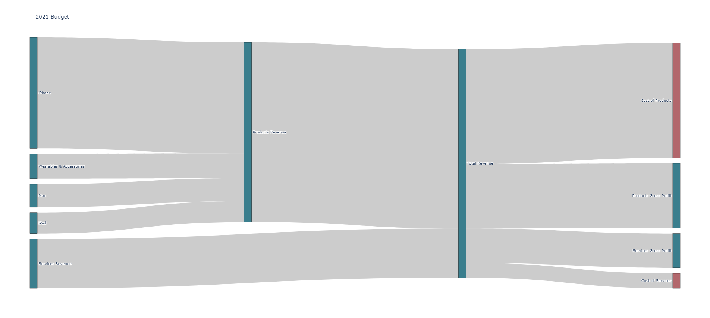
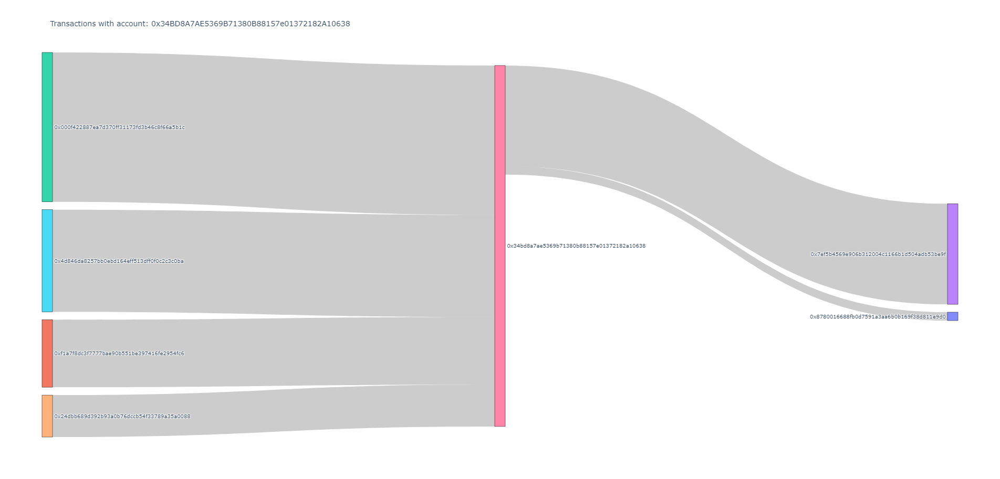

# sankey-transactions
A way to create an overview of transactions into and out of an account, similar to the one shared on `r/dataisbeautiful` [here](https://www.reddit.com/r/dataisbeautiful/comments/otxlbo/apples_latest_quarter_visualized_oc/).

Here is the not-as-pretty thing that this code actually spits out as a web page (and it's interactive):

---
#### Another Example: [Flow of Global Climate Funds](https://www.carbonbrief.org/interactive-how-climate-finance-flows-around-the-world/)

---

### Example Use-Case: Transactions associated with an Ethereum address
**How to use (with Eth address)**
1. Enter desired ETH address up at the top of etherscan.py
2. Run `python etherscan.py`
3. Open the index.html page

---
### How to use (for manual transaction exports, like the one at the top)
**1. Produce a list of all transactions** 
[transactions.csv](transactions.csv) 
(Export from bank, needs some cleaning tho)  

**2. Manually create SOURCE and TARGET values for each transaction** 
[accounts.csv](accounts.csv)  (Also something you just have to manually create for now)  

**3. Summarizing transactions** 
See [this post](https://stackoverflow.com/questions/72842595/python-sum-values-between-unique-pairs-in-ledger-using-hash-tables-or-dictiona?fbclid=IwAR1J4sLWwSZ6j3kU-jo7afdOqA301bB8v9WEm7YgbdrWBb_DlstV-RbkyOY) in StackOverflow for progression of approaches to summarize values  

**4. Run the code** 
`python budget.py` 
